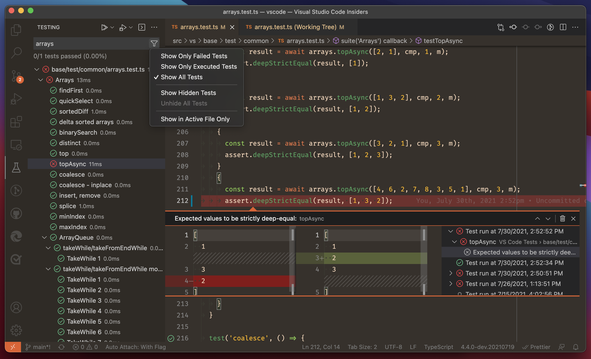

# API Server

This is the API server. It is written in TypeScript, uses Postgres for data storage, Redis for a cache layer, and exposes HTTP endpoints for interaction.

A full list of all endpoints with their descriptions is available at (link here).

## Architecture

This server uses [Nest.js](https://docs.nestjs.com/) both for architectural patterns as well as for API server concerns like authentication & exception handling. Their docs are a good place to start if you're looking to handle cross-cutting concerns like exception handling, connected services, or authentication.

## Getting Started

To contribute to the API:

1. Install Node.js latest LTS (v16 as of Mar 2022).
2. Install Docker.
3. (Optional) Install [Postman](https://www.postman.com/).
4. Clone the repo.
5. Run `npm install`.
6. Run `npm test` and verify all tests pass.

## Developing Locally

To run the project locally, run the following commands:

1. Run `docker compose up -d` to start the database and redis containers.

   _Omit the `-d` and run the next command in a new terminal if you want to see their logs._

2. Run `npx mikro-orm migration:fresh --seed` to provision the database schema and insert some sample data.

   _This command may fail if the database is still starting up._

3. Run `npm run start:dev` to start the API server locally. Saved changes to source files will automatically restart the server.

To stop the servers:

1. Press `Ctrl+C` in the terminal running the API server.

2. Run `docker compose down -v` to stop and remove the PostgreSQL and Redis containers.

   _Omit the `-v` if you want to keep their data for the next time you run them._

### Feature Development Guides

For common development tasks, see the following guides:

- [Create HTTP endpoints](./docs/new_endpoints_guide.md)
- [Database queries and schema](./docs/database_guide.md)
- [Add or modify authorization rules](./docs/modify_authz_guide.md)

## Testing

### Manual Testing via Postman

1. Generate or update the OpenAPI schema at **api-sdk/dist/openapi.yml** by running `npm run build -w app-server -w api-sdk` in the monorepo root.
2. Start the API server per the instructions in [Developing Locally](#developing-locally).
3. Open [Postman](https://www.postman.com/).
4. [Import the OpenAPI schema](https://learning.postman.com/docs/integrations/available-integrations/working-with-openAPI/) into Postman.
5. Use Postman to call the API endpoints.

### Unit & End-to-End Testing

Use the following commands to run tests:

- `npm run test` Run unit tests.
- `npm run test:cov` Run unit tests, collect code coverage, output results to the terminal, and also save results in **coverage/**.
- `npm run test:e2e` Start the database and app server and run end-to-end tests.

  _Because e2e tests require connected services, this command will start the Docker compose environment if it's not running. A random database schema name will be chosen and provisioned to avoid modifying any database records used in local development, but if you don't want the compose environment to remain running after running e2e tests, run `docker compose down -v` after `npm run test:e2e` finishes._

- `npm run test:e2e -- --coverage` Same as above but prints coverage to terminal and saves results in **coverage/**.
- `npm run test:all` Run unit and e2e tests together.
- `npm run test:all -- --coverage` Run unit and e2e tests together, print combined coverage, and save coverage results in **coverage/**. This is what CI uses to verify test coverage is satisfactory.
- `npm test` is an alias of `npm run test:unit`.

You can also run and show test results in VSCode run the tests in the background and display results. To do that, open this project in VSCode and install the recommended extensions.

