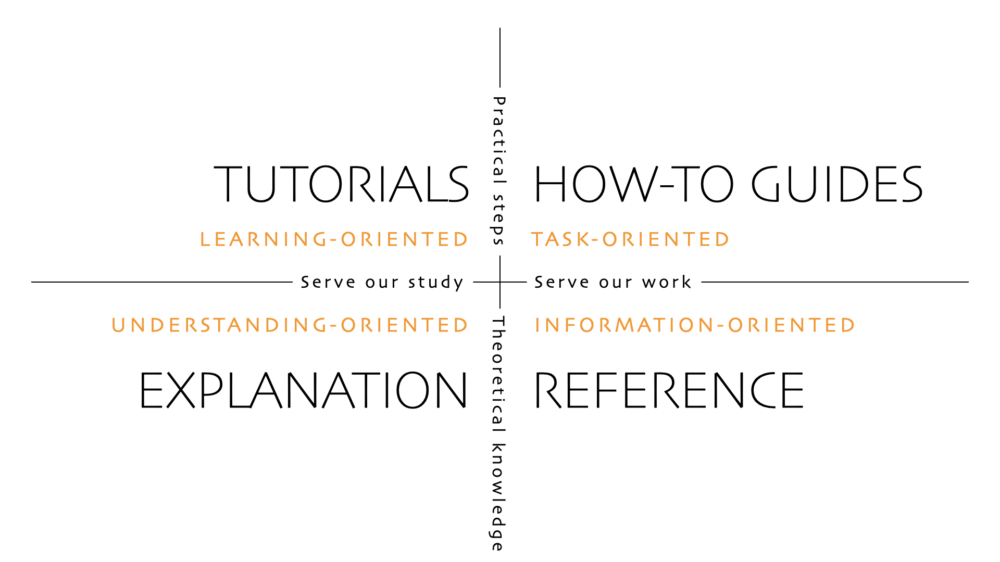

# Web Frontend

## Overview

This is the frontend repo for the app, built in Typescript with React.

The full description of the product is at [this Notion doc](www.example.com).

It's deployed at these URLs:

- https://www.example.com (Production)
- https://stage.example.com (Staging)
- https://deploy-preview-\*--example.netlify.app (PR preview deploys, pointing at the staging backend).

If you have a **@ourcomapny.com** email address, you should be able to log in with Google and get slightly elevated authorization. If you need
higher authorization, ask in the [**#eng**](https://www.example.com) Slack channel.

## Developer Docs

### Quick Start

You should be able to get the whole stack up and running via the guide in the monorepo root. If you just want to run the frontend
and proxy to the staging backend, change the `proxy` field in **package.json** and run `npm start` from this directory.

You can also create an **.env.local** file that overrides the values in **.env**.

### Additional Documentation

Further documentation is organized according to the Diátaxis framework as shown below, except we don't have tutorials, and the technical reference is links to external libraries and major source files in this project.

- [Concepts](./docs/CONCEPTS.md)
- [How-To Guides](./docs/GUIDES.md)
- [Library & Project Reference](./docs/REFERENCE.md)

